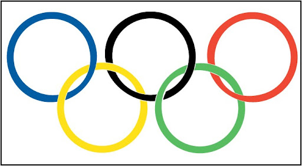
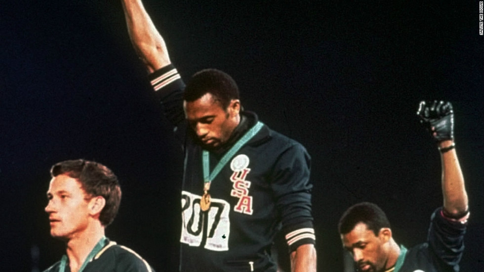
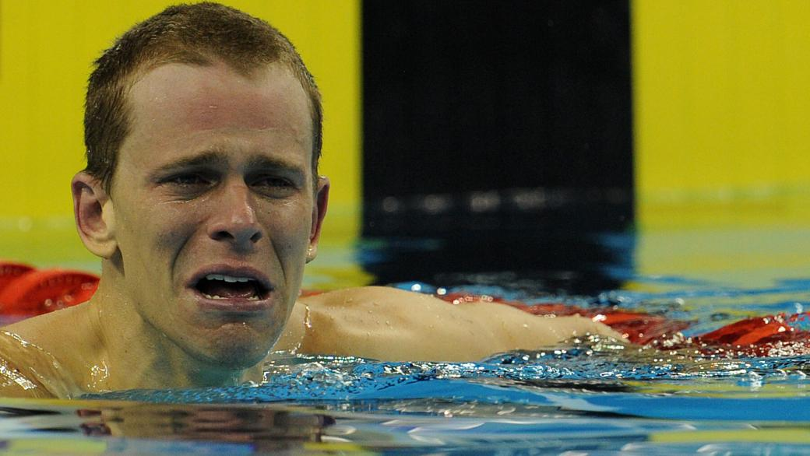
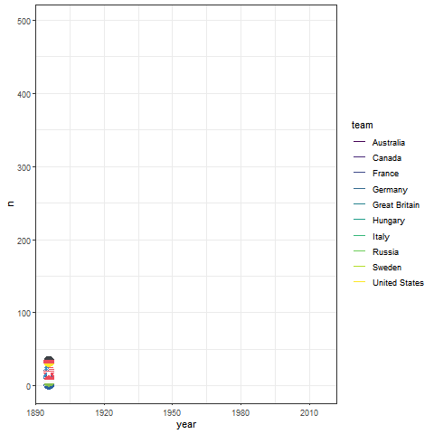
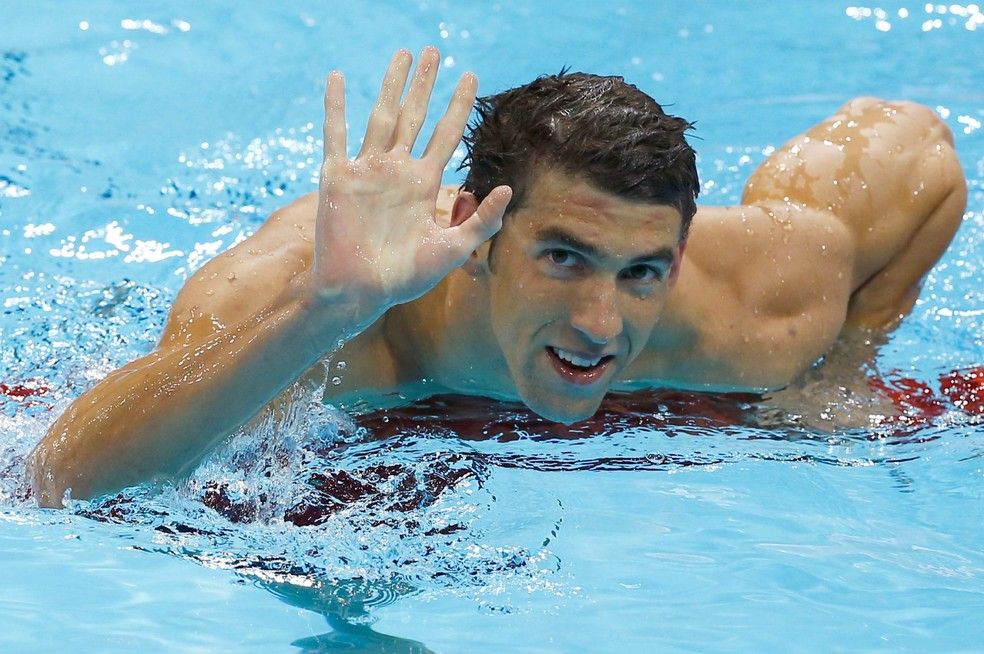

# Pacotes utilizados

\

Nesta análise foram usados os seguintes pacotes:

```{r, warning=FALSE, message=FALSE, results='hide'}

library(tidyverse)
library(ggrepel)
library(bookdown)
library(lubridate)
library(rnaturalearth)
library(sf)
library(ggmap)
library(ggflags)
library(plotly)
library(waffle)
library(gganimate)
library(knitr)
library(kableExtra)
library(DT)
library(leaflet)
library(countrycode)
library(ggforce)
library(viridis)
library(patchwork)

```

\


```{r, olympicIcon, echo = FALSE, fig.align='center', out.width="100%", echo=FALSE}




```

\

```{r, include=FALSE}

# Baixei o dataset original...

# olympics <- rio::import('https://raw.githubusercontent.com/rfordatascience/tidytuesday/master/data/2021/2021-07-27/olympics.csv') %>% 
  as_tibble()


# ... e depois salvei como um xlsx para não ter que baixar toda vez que rodo o knitr

# rio::export(olympics, "olympics.xlsx")

```

```{r, include=FALSE}

# Carregando o dataset a partir do arquivo salvo

# Ao mesmo tempo que carrego o arquivo e salvo em um objeto; foi preciso fazer algumas modifições:

## União Soviética e Comunidade dos Estados Independentes foram consideradas como "Rússia";
## Alemanha Nazista; Alemanha Oriental e Alemanha Ocidental foram todas consideradas como "Alemanha"


olympics <- rio::import("olympics.xlsx") %>% 
  as_tibble() %>% 
  mutate(team = case_when(str_detect(team, "Soviet") ~ "Russia",
                          str_detect(team, "Unified Team") ~ "Russia",
                          str_detect(team, "Germany") ~ "Germany",
                          TRUE ~ as.character(team)),
         noc = case_when(noc == "URS" ~ "RUS",
                         noc == "EUN" ~ "RUS",
                         noc == "GER" ~ "DEU",
                         noc == "GDR" ~ "DEU",
                         noc == "FRG" ~ "DEU",
                         TRUE ~ as.character(noc)))
```


# Como foi a [participação]{.circle-sketch-highlight} dos países ao longo da história das Olimpíadas

Não importa se ganhou ou se perdeu. O que importa, é **participar**. Vamos então checar como tem sido a participação dos diversos países ao longo da história

Na tabela dá para ver que os países que mais participaram foram: [França]{.simple-highlight}, [Grã-Bretanha]{.simple-highlight}, [Grécia]{.simple-highlight}, [Itália]{.simple-highlight}, [Suiça]{.simple-highlight} e [Estados Unidos]{.simple-highlight}.

```{r, include=FALSE}

participacao_olimpiadas <- olympics %>% 
  group_by(year) %>% 
  distinct(noc,.keep_all = T) %>% 
  ungroup() %>% 
  group_by(noc, team) %>% 
  summarise(n = n()) %>% 
  arrange(-n)

```

Já os países que menos tiveram representantes ao longo das edições dos jogos olímpicos:

```{r, echo=FALSE}

tail(participacao_olimpiadas, 10) %>% 
  kable(col.names = c("Sigla", "País", "Participação em Olímpiadas")) %>% 
  kable_paper(c("striped", "hover"))

```

E o [Brasil]{.simple-highlight}, participou de quantas olimpíadas?

```{r, echo=FALSE}

participacao_olimpiadas %>% 
  filter(team == "Brazil") %>% 
  
  kable(col.names = c("Sigla", "País", "Participação em Olímpiadas")) %>% 
  kable_paper(c("striped", "hover"))
```


# Política & Olimpíadas

Os jogos de 1968 ([Cidade do México]{.simple-highlight}) foram palco de uma manifestação política que entrou para história.

Primeiro, vamos ao pódio:

```{r, echo=FALSE}

mexico_1968 <- olympics %>% 
  filter(year == 1968 & event == "Athletics Men's 200 metres" & medal != "NA") %>% 
  select(name, year, city, event, medal) %>% 
  mutate(podio = case_when(medal == "Gold" ~ 1,
                           medal == "Silver" ~ 2,
                           medal == "Bronze" ~ 3)) %>% 
  arrange(podio) %>% 
  select(-c(podio))


mexico_1968$medal = cell_spec(mexico_1968$medal,
                              color = "white",
                              align = "c",
                              tooltip = c("United States", "Australia", "United States"),
                              background = factor(mexico_1968$medal,
                                                  c("Gold", "Silver", "Bronze"),
                                                  c("gold", "silver", "brown")))
mexico_1968 %>% 
  kable(col.names = c("Nome", "Ano", "Cidade", "Evento", "Medalha"),
        escape = F) %>% 
  kable_paper("striped", full_width = F)

```

Depois, explicamos o que aconteceu: num evento tensionado por problemas raciais que aconteciam nos Estados Unidos e no mundo da época, Tommie Smith e John Wesley Carlos fizeram a saudação com o braço levantado no pódio, no estilo *black power* com uma luva negra na mão. Causaram uma grande controvérsia mundial e o fizeram ser expulso dos Jogos pelos dirigentes do Comitê Olímpico dos Estados Unidos ^[Fonte: https://pt.wikipedia.org/wiki/John_Carlos].

[Atitude!]{.circle-sketch-highlight}. Se tivessem ficado quietos, seriam "só" mais uns medalhistas. Ao se manifestarem, além de medalhistas: entraram para a [história]{.sketch-highlight}.





```{r, echo=FALSE}

olympics %>% 
  filter(str_detect(name, "James Cl.* Owens")) %>% 
  select(name, noc, year, city, sport, medal) %>% 
  kable(col.names = c("Nome", "País", "Ano","Cidade", "Esporte", "Medalha")) %>% 
  kable_paper(c("striped", "hover")) %>% 
  kable_styling(full_width = T)
```


E por falar em política, as [Olimpíadas de 1936]{.simple-highlight} também foram marcantes. Às vésperas da Segunda Guerra Mundial (1940-1945), a Alemanha nazista de Hitler enxergava no evento uma forma de mostrar ao mundo seu poderio. A Alemanha não mediu esforços para que o mundo visse um país forte, refazendo todo uma imagem de derrota que ela tinha vivido depois da Primeira Guerra. O governo alemão não poupou gastos: foram 30 milhões de dólares somente na construção do Estádio Olímpico. A estrutura dos jogos foi impecável e considerada por muitos como a melhor já feita para o evento até então ^[Fonte: https://exame.com/mundo/a-geopolitica-das-olimpiadas/].


As tensões políticas da época, contudo, não tardaram a se refletir no esporte. O estadunidense [Jesse Owens]{.simple-highlight} se tornou uma lenda após ganhar quatro medalhas de ouro no atletismo – Hitler se recusou a entregar-lhe as medalhas e deixou o estádio. Outro episódio é o da equipe de remo dos Estados Unidos, com jovens humildes vindos da Universidade de Washington e vítimas da Grande Depressão de 1929, que derrotaram o barco alemão e se sagraram campeões também na frente de Hitler. 


```{r, echo=FALSE, message=FALSE, warning=FALSE, results='hide'}

olympics %>% 
  filter(event %in% c("Athletics Men's 100 metres",
                      "Athletics Men's 200 metres",
                      "Athletics Men's 4 x 100 metres Relay",
                      "Athletics Men's Long Jump"),
         medal != "NA",
         city == "Berlin") %>% 
  mutate(medal = factor(medal,
                        levels = c("Gold", "Silver", "Bronze"),
                        ordered = T)) %>% 
  group_by(event, medal, name, noc) %>% 
  summarise(n = n()) %>% 
  ungroup() %>% 
  mutate(n = str_replace(n,
                         pattern = "[1]",
                         replacement = "X")) %>% 
  arrange(event, medal) %>% 
  pivot_wider(names_from = medal,
              values_from = n) %>% 
  mutate_all(replace_na, " ") %>% 
  select(event, noc, name, Gold, Silver, Bronze) %>% 

  kbl(col.names = c("Evento", "País", "Nome", "Ouro", "Prata", "Bronze")) %>% 
  kable_paper(c("striped", "hover")) %>% 
  kable_styling("striped", full_width = T) %>%
  pack_rows("Athletics Men's 100 metres", 1, 3) %>%
  pack_rows("Athletics Men's 200 metres	", 4, 6) %>% 
  pack_rows("Athletics Men's 4 x 100 metres Relay", 7, 18) %>% 
  pack_rows("Athletics Men's Long Jump", 19, 21)
```

\

Pois é! O cara simplesmente conquistou medalha de ouro em todas as provas que disputou. [Foda-se o nazismo]{.simple-highlight}.

\

# [Quantas]{.circle-sketch-highlight} medalhas teve cada país?

Quando se trata de Olimpíadas, uma primeira pergunta que vem à mente é: quantas medalhas tiveram cada país nas diversas edições?

Na Tabela \@ref(tab:medalhas) temos um exemplo do quantitativo de medalhas que cada país obteve desde a primeira olimpíada.

```{r, include=FALSE}

medals <- olympics %>% 
  drop_na(medal) %>% 
  group_by(year, noc) %>% 
  summarise(n_medals = n()) %>% 
  ungroup() %>% 
  arrange(year, desc(n_medals)) %>% 
  ungroup()

```

```{r medalhas, echo=FALSE}

kable(medals,
      col.names = c("Ano", "País", "Nº de medalhas"),
              caption = "Número de medalhas por país (1896-2016)") %>% 
  kable_paper(c("striped", "hover")) %>%
  kable_styling(full_width = T, bootstrap_options = c("striped", "hover", "responsive")) %>% 
  scroll_box(width = "500px", height = "200px")


```

Legal né? Mas vamos combinar que se tivesse uma tabela interativa que a gente pudesse ir filtrando os resultados, seria mais interessante. Felizmente existe o pacote `DT` que da para construir uma tabela como a Tabela \@ref(tab:medalhasDT) a gente consegue ter uma ideia.

Antes, porém precisamos corrigir um erro craso: o nome do único medalhista de ouro brasileiro da natação está **errado**!!

Vejamos como está:

\

```{r, echo=FALSE}

olympics %>% 
  filter(str_detect(name, "Cielo")) %>% 
  
  kable() %>% 
  kable_paper(c("striped", "hover"))

```

\



\


["Csar "]{.circle-sketch-highlight} é lasca. Chora não Cielo, a gente vai corrigir isso:

```{r, include = FALSE}

olympics_cielo <- olympics %>% 
  mutate(name = case_when(str_detect(name, "Cielo") ~ "César Augusto Cielo Filho",
                                   TRUE ~ as.character(name)))

```

Vamos ver como ficou

\

```{r, echo=FALSE}

olympics_cielo %>% 
  filter(str_detect(name, "Cielo")) %>% 
  kable() %>% 
  kable_paper(c("striped", "hover"))

```

\

Agora sim Cielo!!!!

\


\

Vamos à tabela então:

\


```{r, tab.id = "medalhasDT", echo=FALSE, warning=FALSE, message=FALSE}

olympics_cielo %>% 
  drop_na(medal) %>% 
  group_by(year, team, noc, sport, sex, medal, name) %>%
  distinct(medal, .keep_all = T) %>% 
  summarise(medalha = n()) %>% 
  ungroup() %>% 
  select(-medalha) %>% 
  mutate(year = as.factor(year)) %>% 

  datatable(filter = "top",
          rownames = F,
          options = list(pageLength = 10,
                         autoWidth = TRUE))
```

\

O que eu acho mais fantástico nessa tabela é a possibilidade dela retornar exatamente aquilo que a gente busca. Quer checar? Faz um teste com o [César]{.simple-highlight} Cielo".

```{r include=FALSE}

gold_medals_usa <- olympics %>% 
  drop_na(medal) %>% 
  filter(str_detect(noc, "USA"),
         medal == "Gold") %>% 
  nrow()


silver_medals_usa <- olympics %>% 
  drop_na(medal) %>% 
  filter(str_detect(noc, "USA"),
         medal == "Silver") %>% 
  nrow()

bronze_medals_usa <- olympics %>% 
  drop_na(medal) %>% 
  filter(str_detect(noc, "USA"),
         medal == "Bronze") %>% 
  nrow()
```

\

E se a gente quiser sintetizar os 10 países que mais ganharam medalhas em toda a história das olimpíadas?

\

```{r, include=FALSE}

olympics_top_ten <- olympics %>% 
  drop_na(medal) %>% 
  group_by(team, noc) %>% 
  summarise(n= n()) %>% 
  ungroup() %>% 
  top_n(10) %>% 
  arrange(-n)
```


```{r, echo=FALSE}

olympics_top_ten %>% 
  mutate(flag = countrycode::countrycode(noc,
                                         origin = "iso3c",
                                         destination = "iso2c"),
         flag = str_to_lower(flag),
         flag = sprintf('', flag)) %>% 
  select(flag, team, n) %>% 
  
  kable(col.names = c("", "País", "Nº medalhas"),
        align = c("clc")) %>% 
  kable_paper()
```

\

```{r, echo=FALSE}

olympics_top_ten %>% 
  mutate(iso2 = countrycode(sourcevar = team,
                            origin = "country.name",
                            destination = "iso2c")) %>% 
  mutate(iso2 = str_to_lower(iso2)) %>%
  ggplot(aes(reorder(team, n), n))+
  geom_col(fill = "green",
           width = .5,
           alpha = .7)+
  geom_label(aes(label = n),
             hjust = -0.1,
             fontface = "bold",
             color = "white",
             fill = "green")+
  ggflags::geom_flag(y = -100, aes(country = iso2))+
  coord_flip()+
  theme_bw()+
  ylim(0,6000)+
  xlab(NULL)+
  ylab("Quantidade de medalhas")

```

\

E aqui é a corrida pelas medalhas ao longo dos anos:

```{r, echo=FALSE, warning=FALSE, message=FALSE, results='hide'}

top_ten_1890_2016 <- olympics %>% 
  drop_na(medal) %>% 
  group_by(team, year) %>% 
  summarise(n= n()) %>% 
  ungroup() %>% 
  arrange(-n) %>% 
  filter(team %in% c(olympics_top_ten$team)) %>% 
  
  mutate(iso2 = countrycode(sourcevar = team,
                            origin = "country.name",
                            destination = "iso2c")) %>% 
  mutate(iso2 = str_to_lower(iso2)) 

```

```{r, include=FALSE}

top_ten_1890_2016_animate <- top_ten_1890_2016 %>% 
  ggplot(aes(year, n, group = team, color = team))+
  geom_line(size = 1)+
  scale_color_viridis(discrete = TRUE)+
  ggflags::geom_flag(aes(country = iso2))+
  transition_reveal(year)+
  theme_bw()


# Salvar o gif:

# anim_save("top_ten_1890_2016_animate.gif")

```

<p style="text-align:center">



</p>

\


Bem... seja através de tabela estática ou interativa ou de gráfico animado, o fato é que os **Estados Unidos** são os campeões disparados com:

-   `r gold_medals_usa` medalhas de **ouro**,
-   `r silver_medals_usa` medalhas de **prata**,
-   `r bronze_medals_usa` medalhas de **bronze**,

```{r, echo=FALSE}

olympics %>% 
  drop_na(medal) %>% 
  group_by(noc, medal) %>%
  summarise(n_medals = n()) %>% 
  arrange(desc(n_medals), medal) %>% 
  ungroup() %>% 
  filter(noc == "USA") %>% 
  mutate(medalha = "") %>% 
  select(-medal) %>% 

  kbl(booktabs = T,
      align = "llcc") %>%
  kable_paper(full_width = F) %>%
    column_spec(3, image = spec_image(c("img/1024px-Gold_medal.png", "img/1024px-Silver_medal.png", "img/1024px-Bronze_medal.png"), 80,80))

```


# E falando de **atletas**? Quais seriam os mais medalhados?

Vamos fazer o **top ten** dos maiores medalhistas olímpicos da história:

```{r, include=FALSE}

olympics %>% 
  drop_na(medal) %>% 
  group_by(name, team, sport) %>% 
  summarise(n = n()) %>% 
  ungroup() %>% 
  arrange(-n) %>% 
  top_n(10)

```

\

# Qual o esporte que mais trouxe medalhas **de ouro** para os EUA ao longo da olimpíadas?

\

Se a o intuito for saber as medalhas de "ouro" mesmo; a resposta é a **natação**.

```{r, echo=FALSE}

olympics %>% 
  drop_na(medal) %>% 
  filter(noc == "USA") %>% 
  group_by(noc, sport, medal) %>% 
  summarise(n=n()) %>% 
  ungroup() %>% 
  arrange(-n) %>% 
  top_n(10) %>% 
  mutate(logo = "") %>% 
  select(logo, everything()) %>% 
  

 kbl(booktabs = T,
      align = "ccccc",
     col.names = c("", "País", "Esporte", "Medalha", "Quantidade de medalhas")) %>%
  kable_paper(full_width = T) %>%
    column_spec(1, image = spec_image(c("img/tokyo/Tokyo2020_PictogramSwimmingKinetic.gif",
                                        "img/tokyo/Tokyo2020_PictogramAthleticsKinetic.gif",
                                        "img/tokyo/Tokyo2020_PictogramAthleticsKinetic.gif",
                                        "img/tokyo/Tokyo2020_PictogramBasketballKinetic.gif",
                                        "img/tokyo/Tokyo2020_PictogramSwimmingKinetic.gif",
                                        "img/tokyo/Tokyo2020_PictogramAthleticsKinetic.gif",
                                        "img/tokyo/Tokyo2020_PictogramHockeyKinetic.gif",
                                        "img/tokyo/Tokyo2020_PictogramRowingKinetic.gif",
                                        "img/tokyo/Tokyo2020_PictogramSwimmingKinetic.gif",
                                        "img/tokyo/Tokyo2020_PictogramShootingKinetic.gif"), 200, 200))

```

\

É muito, [muito ouro]{.sketch-highlight}!!!!

\

<p style="text-align:center">


</p>

\


```{r, include=FALSE}
games <- tibble(logo = "",
                nome = c("Joao", "Pedro", "Geovanna"),
                medalha = c("Gold", "Silver","Bronze"))


games %>% 
  kable() %>% 
  kable_paper(full_width = T) %>% 
  column_spec(1, image = spec_image(c("img/1024px-Gold_medal.png",
                                      "img/1024px-Silver_medal.png",
                                      "img/1024px-Bronze_medal.png"), 200,200))
```

\

Mas se considerarmos medalhas [em geral]{.simple-highlight} (ouro/prata/bronze), o esporte campeão é o **atletismo**.

```{r, include=FALSE}

olympics %>% 
  drop_na(medal) %>% 
  group_by(noc, sport) %>% 
  summarise(n=n()) %>% 
  arrange(-n)

```

\

Agora vamos dar uma olhada nas medalhas dos [EUA]{.simple-highlight} ao longo da história das olimpíadas:

```{r, echo=FALSE}

usa_medals_history <- olympics %>% 
  drop_na(medal) %>% 
  mutate(dt = paste(year, "1", "1", sep = "-"),
         dt = ymd(dt)) %>% 
  filter(noc == "USA") %>% 
  group_by(dt, noc, medal) %>% 
  summarise(n_medals = n())


usa_medals_history_plot <- usa_medals_history %>% 
  ggplot(aes(dt, n_medals, group = medal, color = medal))+
  geom_line(size = 1)+
  scale_color_viridis(discrete = TRUE) +
  theme_bw()+
  labs(x = NULL,
       y = NULL,
       color = "Medalha")

usa_medals_history_plot

```

Para analisar mais detalhadamente o histórico de cada medalha, podemos recorrer ao `facet.wrap()`:

\

```{r, echo=FALSE}

usa_medals_history %>% 
  ggplot(aes(dt, n_medals, group = medal, color = medal))+
  geom_line(show.legend = F,
            size = 1)+
  theme_bw()+
  scale_color_viridis(discrete = TRUE) +
  labs(x = NULL,
       y = NULL)+
  facet_wrap(~medal)

```

\

Ou a gente pode fazer isso de forma [dinâmica]{.circle-sketch-highlight} usando o `plotly()`:

```{r, echo=FALSE}

ggplotly(usa_medals_history_plot,
         tooltip = "n_medals",
         dynamicTicks = T) %>% 
  layout(hovermode = "x")

```

Agora um olhar mais atento na última década:

```{r, echo=FALSE}

usa_medals_history_plot_zoom <- usa_medals_history %>% 
  ggplot(aes(dt, n_medals, group = medal, color = medal))+
  geom_line(size = 1)+
  scale_color_viridis(discrete = TRUE) +
  facet_zoom(x = year(dt)>2000 & year(dt)<2016)+
  theme_bw()+
  labs(x = NULL,
       y = NULL,
       color = "Medalha")+
  theme(strip.background = element_rect(fill = "white",
                                        linetype = 2))

usa_medals_history_plot_zoom
```

\

E dentro destes esportes tão premiados, [quem mais contribuiu]{.circle-sketch-highlight} para os EUA?

\

```{r, echo=FALSE}

olympics %>% 
  drop_na(medal) %>% 
  filter(noc == "USA") %>% 
  group_by(name, sex, noc, sport) %>% 
  summarise(n=n()) %>% 
  ungroup() %>% 
  arrange(-n) %>% 
  top_n(10) %>% 
  
  
  kable(col.names = c("Nome", "Gênero", "País", "Esporte", "Nº de medalhas")) %>% 
  kable_paper()

```

\

Disparadamente, [Michael Phelps]{.simple-highlight} é o cara.

E como é o histórico dele?

\

```{r, echo=FALSE}

olympics %>%
  filter(str_detect(name, "Michael Fred Phelps")) %>%
  group_by(medal) %>%
  summarise(n = n()) %>%
  ungroup %>% 
  arrange(-n) %>% 
  
  kable(col.names = c("Medalha", "Nº de medalhas")) %>% 
  kable_paper()


```

\

O cara é bom mesmo. Só [não ganhou]{.simple-highlight} medalhas em duas provas que disputou.

\

```{r, include=FALSE}

pelphs_gold <- olympics %>%
  filter(str_detect(name, "Michael Fred Phelps"),
         medal == "Gold")

pelphs_silver <- olympics %>%
  filter(str_detect(name, "Michael Fred Phelps"),
         medal == "Silver")

pelphs_bronze <- olympics %>%
  filter(str_detect(name, "Michael Fred Phelps"),
         medal == "Bronze")

```

\

Focando especificamente nas medalhas que ganhou: impressionantes `r nrow(pelphs_gold)` medalhas de **ouro**, `r nrow(pelphs_silver)` medalhas de **prata** e `r nrow(pelphs_bronze)` medalhas de **bronze**.

```{r, echo=FALSE}

phelps <- olympics %>%
  drop_na(medal) %>% 
  filter(str_detect(name, "Michael Fred Phelps")) %>%
  group_by(medal) %>%
  summarise(n = n()) %>%
  arrange(-n)

phelps$medal = cell_spec(
  phelps$medal, color = "white", align = "c", 
  background = factor(phelps$medal, c("Gold", "Silver", "Bronze"), c("gold", "silver", "brown")))

kbl(phelps, escape = F) %>%
  kable_paper("striped", full_width = F)

```

\

Que idade ele tinha quando ganhou a primeira medalha olímpica e qual [a média]{.simple-highlight} da idades dos caras com os quais ele competia?

```{r, echo=FALSE}

# Primeiro é preciso saber quais os anos que o Phelps competiu:

idade_phelps <- olympics %>% 
  filter(str_detect(name, "Michael .* Phelps")) %>% 
  group_by(year, age) %>% 
  summarise() %>% 
  ungroup() %>% 
  rename("age_phelps" = age)

# resposta: 2000 a 2016

idade_media_swimming <- olympics %>% 
  filter(sport == "Swimming" & year %in% c(2000:2016)) %>% 
  group_by(year) %>% 
  summarise(media_idade = mean(age, na.rm = T)) %>% 
  mutate(media_idade = as.integer(media_idade))


cbind(idade_phelps, idade_media_swimming$media_idade) %>% 
  kable(col.names = c("Ano", "Idade do Phelps", "Idade média dos nadadores")) %>% 
  kable_paper()
```

\

É simples assim: o cara quando era um guri de apenas 15 anos ganhou de uma galera mais experiente que estava na faixa dos 21 anos. No final da carreira, quando já era um senhor de 31 anos, continuou colando os jovens (na faixa dos 22 anos) no bolso. O cara é um monstro mesmo!!!

\

E em que edição ele mais ganhou medalhas?

```{r, echo=FALSE}

olympics %>% 
  filter(str_detect(name, "Michael Fred Phelps")) %>% 
  group_by(city, year) %>% 
  summarise(n = n()) %>% 
  arrange(-n) %>% 
  kable() %>% 
  kable_paper()


```

Aparentemente, o ápice dele foi entre 2004 (Atenas) e 2008 (Pequim), quando ganhou 8 medalhas em cada edição.

valeu Phelps!!!

<p style="text-align:center">



</p>

# Mas será que os Estados Unidos são tão bons assim em outro esporte nos quais eles são famosos: o basquete?

```{r, include=FALSE}

olympics %>% 
  drop_na(medal) %>%
  filter(sport == "Basketball") %>% 
  group_by(noc) %>% # acho que aqui tem que colocar o "sport" também como group pois está contando 12 medalhas de ouro para cada pódio ganho. Se eu agrupo, contabilizo a medalha pelo time, e não pelos atletas
  summarise(n=n()) %>% 
  arrange(-n)

```

A resposta é: **sem dúvida**.

Que os EUA são hegemônicos no basquete, não há dúvida. Mas já que o lugar mais alto do pódio já está "reservado", fiquei curioso para saber se algum dia o Brasil dividiu o pódio com os americanos:

```{r, include=FALSE}

# Dá pra fazer de 2 formas:
# Dessa (um pouco grosseira):

olympics %>% 
  drop_na(medal) %>% 
  filter(sport == "Basketball",
         noc %in% c("USA", "BRA"),
         sex == "M") %>% 
  group_by(noc, year, sport, medal) %>% 
  summarise(n_jogadores = n()) %>% 
  ungroup() %>% 
  mutate(n_jogadores = "X") %>% 
  pivot_wider(names_from = year,
              values_from = n_jogadores) %>% 
  mutate_all(replace_na, "-")


# Ou dessa (mais refinada, uma vez que usa o distinct para medalhar o PAÍS - e não a quantidade de jogadores)


bra_usa_basketball <- olympics %>% 
  drop_na(medal) %>% 
  filter(sport == "Basketball",
         noc %in% c("USA", "BRA"),
         sex == "M") %>% 
  group_by(year, noc, sport, medal) %>%
  distinct(medal, .keep_all = T) %>% 
  summarise(medalha = n()) %>% 
  ungroup() %>% 
  mutate(medalha = str_replace(medalha,
                                   pattern = "[1]",
                                   replacement = "X")) %>% 
  pivot_wider(names_from = year,
              values_from = medalha) %>% 
  mutate_all(replace_na, "-") %>% 
  arrange(noc) %>% 
  select(-sport) %>%  
  rename("País" = noc,
         "Medalha" = medal)


bra_usa_basketball

bra_usa_basketball$Medalha = cell_spec(
  bra_usa_basketball$Medalha, color = "white", align = "c", 
  background = factor(bra_usa_basketball$Medalha, c("Gold", "Silver", "Bronze"), c("gold", "silver", "brown")))

```

```{r, echo=FALSE}

kbl(bra_usa_basketball,
    escape = F) %>%
  kable_paper("striped", full_width = F) %>% 
  row_spec(1, background = "lightgreen")
```


A resposta é **SIM** e em 3 ocasiões: 1948, 1960 e 1964.

Pela tabela acima ainda dá pra perceber que os americanos só não ocuparam o 1º lugar no pódio uma única vez: **1972**. E aparentemente foi babado: encontrei a seguinte observação no Wikipedia

```{r, echo=FALSE}


olympics %>% 
  drop_na(medal) %>% 
  filter(sport == "Basketball",
         noc %in% c("USA"),
         sex == "M") %>% 
  group_by(noc, year, medal) %>% 
  summarise(n_jogadores = n()) %>% 
  ungroup() %>% 
  pivot_wider(names_from = year,
              values_from = n_jogadores) %>% 
  select(noc, medal, `1972`) %>% 
  
  kable() %>% 
  row_spec(3, background = "yellow") %>% 
  kable_styling(bootstrap_options = "striped", full_width = T)
  

```

> Esta foi a primeira vez em que os norte-americanos não ganharam a medalha de ouro no basquete. A partida final, entre URSS e EUA foi controversa. Os EUA viraram a partida nos últimos segundos, ganhando de 50-49. Renato William Jones, figura proeminente da FIBA na época, ordenou que houvesse mais três segundos de partida, alegando um mau funcionamento dos relógios que cronometravam o tempo. Foi o suficiente para que os soviéticos virassem o jogo, vencendo de 51-50. Jones não tinha autoridade para fazer tal mudança no jogo, mas seu prestígio era tal que os árbitros acataram a ordem. Os jogadores norte-americanos jamais aceitaram a prata. Uma revisão da arbitragem e do resultado da partida não foi possível na época em virtude da bipolarização da Guerra Fria: os revisores eram, em sua maioria, pró-União Soviética

# Vamos espacializar os dados?

Primeiro foi preciso acessar a API da Google usando a função `ggmap::register_google(key = "")`

```{r, echo=FALSE}

# register_google(key = "***")

```

Depois, obtive as sedes das olimpíadas [nesse site da Wikipedia](https://en.wikipedia.org/wiki/List_of_Olympic_Games_host_cities) e baixei em um arquivo em excel.

A partir daí, importei o arquivo e eliminei os registros nos quais as Olímpíadas haviam sido canceladas devido à I e II Guerras.

```{r, echo=FALSE}

host_cities_olympics <- rio::import("host_cities_olympics.xlsx") %>% 
  as_tibble() %>% 
  janitor::clean_names()

host_cities_olympics_no_war <- host_cities_olympics %>% 
  filter(!str_detect(opening_ceremony, "Cancelled"))

```

Depois, usei a **impressionante** função `ggmap::geocode()`. Basta passar o nome de uma cidade e a função de retorna a longitude e latitude da cidade:

```{r, include=FALSE}

# O código está a seguir; no entanto; ele foi desabilitado porque toda vez que eu fazia o knit o R baixava os tados todos de novo.


# pre_host_cities_olympics_no_war_coordinates <- geocode(host_cities_olympics_no_war$city, output = "latlona") %>% 
#    drop_na(address)


# A solução foi baixar uma vez e exportar o resultado como um dataset para ser importado novamente


# rio::export(pre_host_cities_olympics_no_war_coordinates, "pre_host_cities_olympics_no_war_coordinates.xlsx")

# Depois de exportado também desabilitei o código para não dar erro.
# Em seguida, importei o dataset "pre_host_cities_olympics_no_war_coordinates" e dei o nome de "host_cities_olympics_no_war_coordinates"


host_cities_olympics_no_war_coordinates <- rio::import("pre_host_cities_olympics_no_war_coordinates.xlsx")
```

Em seguida foi só juntar o dataset das cidades com o dataset das coordenadas geográficas...

```{r, include=FALSE}

host_cities_olympics_st <- cbind(host_cities_olympics_no_war, host_cities_olympics_no_war_coordinates)

```

... e depois usar o **maravilhoso** pacote `sf` para transformar meros números em coordenadas geográficas. **Observação** no Coordinate Reference System (CRS) coloquei 4326; que corresponde ao código EPSG para o sistema de coordenadas geográficas WGS 84.

```{r, include=FALSE}
host_cities_olympics_sf <- host_cities_olympics_st %>% 
  st_as_sf(coords = c("lon", "lat"),
           crs = 4326)
```

Por fim, mas não menos importante;foi preciso obter o mapa mundi como fundo. Consegui isso usando a função `ne_countries(returnclass = "sf")` do pacote `rnaturalearth`

```{r mapaMundi, include=FALSE}

world <- ne_countries(returnclass = "sf")

```

Com a coluna *geometry* devidamente criada, foi fácil projetar usando `ggplot() + geom_sf()`:

```{r, echo=FALSE}

ggplot()+
  geom_sf(data = world)+
  geom_sf(data = host_cities_olympics_sf)+
  coord_sf(crs = "+proj=robin")+
  theme(panel.grid = element_line(colour = "black"),
        panel.background = element_blank())+
  xlab("")+
  ylab("")
```

Desse jeito não dá para ver os nomes dos países.

Então, resolvi usar o `ggplot2::geom_label()` para vermos os nomes:

```{r, echo=FALSE, warning=FALSE}

ggplot()+
  geom_sf(data = world)+
  geom_sf(data = host_cities_olympics_sf)+
  geom_label(data = host_cities_olympics_sf,
                  aes(label = city, geometry = geometry),
                  stat = "sf_coordinates")
```

Ficou uma confusão danada. Que tal usar o `ggrepel::geom_label_repel` para afastar os labels?

```{r, echo=FALSE, warning=FALSE}

ggplot()+
  geom_sf(data = world)+
  geom_sf(data = host_cities_olympics_sf)+
  geom_label_repel(data = host_cities_olympics_sf,
                  aes(label = city, geometry = geometry),
                  stat = "sf_coordinates",
                  force = 90,
                  color = "red",
                  max.overlaps = Inf)
```

Eita!!! Parece que ficou ainda mais bagunçado, pois o repel afastou vários nomes que estavam sobrepostos de modo que todos eles agora aparecem.

Uma tentativa de resolver isso é dar um close, por exemplo, na Europa:

Primeiro crio um subset só para a Europa

```{r, include=FALSE}

europe_host_cities_olympics_sf <- host_cities_olympics_sf %>% 
  drop_na(winter) %>% 
  filter(continent == "Europe",
         city != "Albertville")

europe_host_cities_olympics_sf %>% 
  print(n=Inf)

```

Depois, com o pacote `st`, crio um grid a partir desse subset

```{r}

europe_host_cities_grid <- st_make_grid(st_bbox(europe_host_cities_olympics_sf), n = 1)

```

Depois, eu seleciono as cidades que estão apenas dentro deste grid, usanto a função `sf::st_intersection()`:

```{r}

host_cities_olympics_sf_inner_grid <- st_intersection(host_cities_olympics_sf,
                                                      europe_host_cities_grid)

```

Em seguida, eu crio um plot que vou usar logo mais no `patchwork`

```{r}

europe_host_cities_plot <- ggplot()+
  geom_sf(data = world)+
  geom_sf(data = europe_host_cities_grid, fill = NA, color = "red")+
  coord_sf(crs = "+proj=robin")

```

Agora eu faço um *crop* usando como referência justamente o grid:

```{r}

europe_crop <- world %>% 
  st_crop(europe_host_cities_grid)

```

E crio o plot que agrega o dataset que contem o *grid* dos países europeus + o dataset que contém os pontos que reperesentam as cidades-sede:

```{r}

europe_crop_plot <- ggplot()+
  geom_sf(data = europe_crop) + 
  geom_sf(data = host_cities_olympics_sf_inner_grid)+
  geom_sf_label(data = host_cities_olympics_sf_inner_grid,
                aes(label = city),
                size = 5)

europe_crop_plot
```

Para visualizar o mundo todo (com a delimitação do grid) e a área do crop **ao mesmo tempo** utilizo o `patchwork`

```{r}

europe_host_cities_plot + europe_crop_plot

```

E se a gente fizer um mapa de calor, a gente consegue ver claramente a geopolítica dos Jogos Olimpícos. Majoritariamente eles oocorreram na Europa.

```{r}

ggplot()+
  geom_sf(data = host_cities_olympics_sf)+
  stat_density2d(data = host_cities_olympics_st,
                 aes(lon, lat,
                     fill = ..density..),
                 geom = "raster",
                 contour = F,
                 show.legend = F)+
  scale_fill_distiller(palette = "Spectral",
                       direction = -1)+
  geom_sf(data = world, fill = "white", alpha = .2)+
  theme(panel.background = element_rect(fill = "#3288bd"),
        panel.grid = element_line(color = NA),
        axis.title = element_blank())


```

Para escapar da forma estática, é possível incrementar a visualização.

Uma alternativa, é usar o `plotly` para tornar os pontos interativos:

```{r}

host_cities_plot <- ggplot()+
  geom_sf(data = world)+
  geom_sf(data = host_cities_olympics_sf,
          aes(fill = city),
          shape = 21,
          color = "white",
          size = 3,
          show.legend = F)+
  coord_sf(crs = "+proj=robin")+
  theme(panel.grid = element_line(colour = "black"),
        panel.background = element_blank())+
  xlab("")+
  ylab("")


ggplotly(host_cities_plot,
         tooltip = "city",
         dynamicTicks = T)

```

Mas vamos combinar que nada se compara ao `leaflet`:

Primeiro, crio uma outra coluna que permite classificar as edições em olimpíadas de **verão** e de **inverno**

```{r}

host_cities_olympics_sf_summer <- host_cities_olympics_sf %>% 
  drop_na(summer) %>% 
  mutate(tipo = "Verão")


host_cities_olympics_sf_winter <- host_cities_olympics_sf %>% 
  drop_na(winter) %>% 
  mutate(tipo = "Inverno")

```

Depois, para incrementar o mapa, crio, com a função `leaflet::makeIcon`, um ícone específico para identificar o ponto a ser plotado. Crio um ponto para **verão** e outro para **inverno**.

```{r}
olympicIcon_summer <- makeIcon(
  iconUrl = "img/gold_coin_animated.gif",
  iconWidth = 20, iconHeight = 20)


olympicIcon_winter <- makeIcon(
  iconUrl = "img/blue_coin_animated_2.gif",
  iconWidth = 20, iconHeight = 20)
```

Agora ploto as sedes usando o argumento `leaflet::addMarkers(clusterOptions = markerClusterOptions())`

```{r}
leaflet() %>% 
  addTiles() %>% 
  addMarkers(data = host_cities_olympics_sf_summer,
             label = ~city,
             icon = olympicIcon_summer,
             clusterOptions = markerClusterOptions(),
             popup= paste("<b> Ano: </b>", host_cities_olympics_sf_summer$year,"<br>",
                          "<b> Tipo: </b>", host_cities_olympics_sf_summer$tipo, "<br>",
                          "<b> Abertura: </b>", host_cities_olympics_sf_summer$opening_ceremony)) %>% 
  addMarkers(data = host_cities_olympics_sf_winter,
             label = ~city,
             icon = olympicIcon_winter,
             clusterOptions = markerClusterOptions(),
             popup= paste("<b> Ano: </b>", host_cities_olympics_sf_winter$year,"<br>",
                          "<b> Tipo: </b>", host_cities_olympics_sf_winter$tipo, "<br>",
                          "<b> Abertura: </b>", host_cities_olympics_sf_winter$opening_ceremony))
```

Agora sim; não oficou poluído visualmente. Além de tudo, dá para passar o recado de que:

```{r}

tibble("Uma medalha desta:" = "",
       "equivale a" = c("Jogos de Verão",
                        "Jogos de Inverno")) %>% 
  kbl(booktabs = T,
      align = "cl") %>%
  kable_paper(full_width = F) %>%
    column_spec(1, image = spec_image(c("img/gold_coin_animated.gif", "img/blue_coin_animated_2.gif"), 80,80))

```

> Uma dica: Se quiser colocar o gif *inline* é preciso observar o tamanho da imagem. O tamanho original da medalha do arquivo .gif que encontrei é muito grande. É tipo assim:

<p style="text-align:center">


</p>

> Talvez haja uma forma direta no próprio R para definir o tamanho das imagens. Como o tempo tava curto, acabei recorrendo ao [site ezgif](https://ezgif.com/) que tem um ferramenta simples e prática chama *GIF Resizer*. O resultado foi que, depois do redimensionamento, a medalha ficou assim:

<p style="text-align:center">


</p>

# E se a gente quiser saber só com os países no mapa (sem as cidades)?

Com o `ggflags::geom_flag()` é possível plotar as bandeiras ao invés dos pontos:

```{r}

host_countries <- world %>% 
  filter(name %in% c(host_cities_olympics_sf$country))

ggplot()+
  geom_sf(data = world, fill = "orange", alpha = .6)+
  geom_flag(data = host_countries,
            aes(country = str_to_lower(iso_a2), geometry = geometry),
            stat = "sf_coordinates")+
  coord_sf(crs = "+proj=robin")+
  theme(panel.grid = element_line(colour = "black"),
        panel.background = element_rect(fill = "azure"),
        axis.title = element_blank())

```

<p style="text-align:center">

É isso. Queria agradecer ao pessoal da [curso-r](https://curso-r.com/). O curso foi excepcional. Aprendi muito com esse exercício. Me consumiu muitas horas mas valeu cada segundo!!!

</p>

Encerramos com o adeus mais famoso das Olimpíadas:


<p style="text-align:center">


</p>